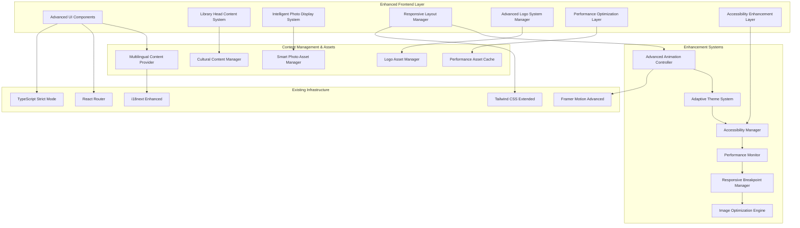
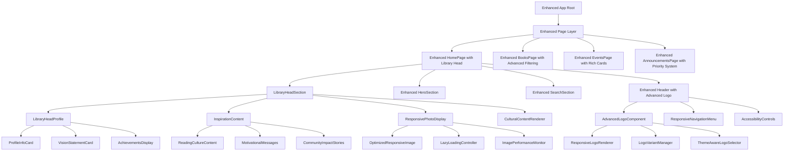
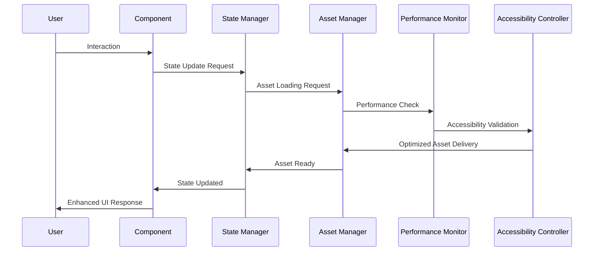

# Design Document: UI Enhancement with Library Head Content

## Overview

This design document outlines the comprehensive technical approach for enhancing the user interface of the Yeka Sub City Library web application while integrating inspiring content about the library head, Ato Yohannes Siyum. The enhancement focuses on improving visual design, user experience, accessibility, and performance across the Home, Books, Events, and Announcements pages while adding meaningful content that promotes reading culture and Ethiopian literary heritage.

The design includes a complete visual identity overhaul with a sophisticated logo system, professional photo integration, enhanced responsive design patterns, comprehensive accessibility improvements, and performance optimizations. The enhancement leverages the existing React/TypeScript architecture with Tailwind CSS, Framer Motion animations, and i18next internationalization to create a cohesive, modern, culturally relevant, and highly performant user experience.

### Key Enhancement Areas

1. **Advanced Logo System**: Multi-variant, responsive logo implementation with theme awareness
2. **Library Head Content Integration**: Professional photo integration with inspiring cultural content
3. **Enhanced Responsive Design**: Mobile-first approach with advanced breakpoint management
4. **Comprehensive Accessibility**: WCAG 2.1 AA compliance with assistive technology support
5. **Performance Optimization**: Advanced image optimization, lazy loading, and animation performance
6. **Multilingual Enhancement**: Improved Ethiopian script rendering and cultural content management
7. **Advanced Component Architecture**: Modular, reusable components with enhanced specifications

## Architecture

### Enhanced System Architecture Overview

The UI enhancement system follows a sophisticated, modular, component-based architecture that integrates seamlessly with the existing library management system while introducing advanced performance and accessibility features:



### Advanced Component Hierarchy

The enhanced system introduces sophisticated components while extending existing ones with advanced capabilities:



### Enhanced Data Flow Architecture



## Components and Interfaces

### Advanced Logo System Components

#### 1. AdvancedLogoComponent

**Purpose**: Sophisticated, multi-variant logo implementation with intelligent responsive behavior, theme awareness, and performance optimization.

**Enhanced Interface**:
```typescript
interface AdvancedLogoComponentProps {
  variant: 'full' | 'icon' | 'horizontal' | 'stacked' | 'minimal';
  size: 'xs' | 'sm' | 'md' | 'lg' | 'xl' | 'auto';
  className?: string;
  showText?: boolean;
  theme?: 'light' | 'dark' | 'auto';
  priority?: boolean; // For performance optimization
  loading?: 'lazy' | 'eager';
  onLoad?: () => void;
  onError?: (error: Error) => void;
  accessibility?: {
    ariaLabel?: string;
    role?: string;
    describedBy?: string;
  };
  performance?: {
    preload?: boolean;
    format?: 'svg' | 'webp' | 'png' | 'auto';
    quality?: number;
  };
}

interface EnhancedLogoAssets {
  variants: {
    full: LogoVariantAsset;      // Complete logo with text
    icon: LogoVariantAsset;      // Icon/symbol only
    horizontal: LogoVariantAsset; // Horizontal layout
    stacked: LogoVariantAsset;   // Vertical/stacked layout
    minimal: LogoVariantAsset;   // Simplified version
  };
  responsive: {
    breakpoints: ResponsiveLogoConfig;
    adaptiveRules: AdaptiveDisplayRules;
  };
  performance: {
    preloadStrategy: PreloadStrategy;
    cachePolicy: CachePolicy;
    compressionSettings: CompressionSettings;
  };
  accessibility: {
    altTexts: LocalizedAltTexts;
    ariaLabels: LocalizedAriaLabels;
    semanticRoles: SemanticRoleConfig;
  };
}

interface LogoVariantAsset {
  light: MultiFormatAsset;
  dark: MultiFormatAsset;
  monochrome: MultiFormatAsset;
  highContrast: MultiFormatAsset; // For accessibility
  dimensions: {
    width: number;
    height: number;
    aspectRatio: string;
    viewBox?: string; // For SVG
  };
  usageGuidelines: {
    minSize: ResponsiveSize;
    maxSize: ResponsiveSize;
    clearSpace: ResponsiveSpacing;
    backgrounds: AllowedBackground[];
    contexts: UsageContext[];
  };
  performance: {
    fileSize: number;
    loadTime: number;
    compressionRatio: number;
  };
}

interface MultiFormatAsset {
  svg: {
    url: string;
    inline?: string; // For critical path optimization
    optimized: boolean;
  };
  raster: {
    webp: ResponsiveImageSet;
    avif?: ResponsiveImageSet; // Next-gen format
    png: ResponsiveImageSet;   // Fallback
    jpeg?: ResponsiveImageSet; // Alternative fallback
  };
  metadata: {
    colorProfile: string;
    transparency: boolean;
    animated: boolean;
  };
}

interface ResponsiveImageSet {
  '1x': string;  // Standard DPI
  '2x': string;  // High DPI
  '3x': string;  // Ultra high DPI
  '4x'?: string; // Future-proofing
}
```

**Advanced Features**:
- Intelligent format selection based on browser support
- Automatic theme detection and switching
- Performance-optimized loading strategies
- Comprehensive accessibility support
- Advanced responsive behavior with breakpoint awareness
- Error handling with graceful fallbacks
- Analytics integration for usage tracking

#### 2. LibraryHeadSection Component

**Purpose**: Comprehensive container for library head content integration with advanced layout management and cultural content presentation.

**Enhanced Interface**:
```typescript
interface LibraryHeadSectionProps {
  className?: string;
  variant?: 'hero' | 'featured' | 'compact' | 'sidebar';
  layout?: 'horizontal' | 'vertical' | 'grid' | 'masonry';
  showPhoto?: boolean;
  photoPosition?: 'left' | 'right' | 'top' | 'background';
  language: SupportedLanguage;
  animationLevel?: 'none' | 'reduced' | 'full';
  accessibility?: AccessibilityConfig;
  performance?: PerformanceConfig;
  culturalTheme?: 'default' | 'ethiopian' | 'modern';
}

interface LibraryHeadContent {
  profile: {
    name: LocalizedString;
    title: LocalizedString;
    bio: LocalizedString;
    vision: LocalizedString;
    achievements: LocalizedString[];
    experience: {
      years: number;
      positions: LocalizedString[];
      education: LocalizedString[];
    };
  };
  inspiration: {
    readingCulture: LocalizedRichContent;
    motivation: LocalizedString[];
    libraryMission: LocalizedRichContent;
    communityImpact: LocalizedRichContent;
    futureVision: LocalizedRichContent;
  };
  media: {
    primaryPhoto: EnhancedPhotoAsset;
    alternativePhotos: EnhancedPhotoAsset[];
    backgroundImages?: EnhancedPhotoAsset[];
  };
  metadata: {
    lastUpdated: Date;
    version: string;
    approvedBy: string;
    culturalReview: CulturalReviewStatus;
  };
}

interface LocalizedRichContent {
  en: RichTextContent;
  am: RichTextContent;
  om: RichTextContent;
}

interface RichTextContent {
  text: string;
  formatting: TextFormatting[];
  media?: MediaReference[];
  links?: LinkReference[];
}
```

**Key Features**:
- Advanced layout management with multiple presentation modes
- Rich content support with formatting and media integration
- Cultural theme awareness for appropriate presentation
- Performance-optimized content loading
- Comprehensive accessibility features
- Multi-language support with proper script rendering

#### 3. ResponsivePhotoDisplay Component

**Purpose**: Advanced photo display system with intelligent optimization, accessibility features, and performance monitoring.

**Enhanced Interface**:
```typescript
interface ResponsivePhotoDisplayProps {
  src: string | PhotoAssetCollection;
  alt: LocalizedString;
  sizes: AdvancedResponsiveSizes;
  lazy?: boolean;
  priority?: boolean;
  className?: string;
  caption?: LocalizedString;
  aspectRatio?: string;
  objectFit?: 'cover' | 'contain' | 'fill' | 'scale-down';
  placeholder?: PlaceholderConfig;
  loading?: LoadingConfig;
  error?: ErrorConfig;
  accessibility?: PhotoAccessibilityConfig;
  performance?: PhotoPerformanceConfig;
  analytics?: PhotoAnalyticsConfig;
}

interface AdvancedResponsiveSizes {
  mobile: ResponsiveSizeConfig;
  tablet: ResponsiveSizeConfig;
  desktop: ResponsiveSizeConfig;
  xl: ResponsiveSizeConfig;
  xxl?: ResponsiveSizeConfig;
  print?: ResponsiveSizeConfig;
}

interface ResponsiveSizeConfig {
  width: string;
  height?: string;
  quality?: number;
  format?: 'auto' | 'webp' | 'avif' | 'jpeg' | 'png';
  density?: number[];
}

interface PhotoAssetCollection {
  original: string;
  optimized: {
    webp: ResponsiveImageSet;
    avif?: ResponsiveImageSet;
    jpeg: ResponsiveImageSet;
  };
  placeholder: {
    blurred: string;
    lowQuality: string;
    svg: string;
  };
  metadata: {
    width: number;
    height: number;
    aspectRatio: number;
    colorPalette: string[];
    dominantColor: string;
  };
}

interface PlaceholderConfig {
  type: 'blur' | 'skeleton' | 'color' | 'svg';
  color?: string;
  blur?: number;
  skeleton?: SkeletonConfig;
}

interface LoadingConfig {
  strategy: 'lazy' | 'eager' | 'auto';
  threshold?: number;
  rootMargin?: string;
  fadeIn?: boolean;
  duration?: number;
}

interface PhotoAccessibilityConfig {
  alt: LocalizedString;
  longDescription?: LocalizedString;
  role?: string;
  ariaDescribedBy?: string;
  focusable?: boolean;
}
```

**Advanced Features**:
- Intelligent format selection and optimization
- Advanced lazy loading with intersection observer
- Comprehensive placeholder strategies
- Performance monitoring and analytics
- Accessibility-first design with screen reader support
- Error handling with graceful degradation
- Advanced caching strategies

#### 4. Enhanced Page Components

**Enhanced Header Component**:
```typescript
interface EnhancedHeaderProps {
  onSearch?: (query: string) => void;
  variant?: 'default' | 'transparent' | 'compact' | 'extended';
  sticky?: boolean;
  showLogo?: boolean;
  showSearch?: boolean;
  showNavigation?: boolean;
  accessibility?: HeaderAccessibilityConfig;
  performance?: HeaderPerformanceConfig;
}

interface HeaderAccessibilityConfig {
  skipLinks: SkipLinkConfig[];
  landmarks: LandmarkConfig;
  keyboardNavigation: KeyboardNavigationConfig;
  screenReader: ScreenReaderConfig;
}
```

**Key Features**:
- Advanced logo integration with intelligent sizing
- Improved responsive navigation with accessibility focus
- Enhanced mobile menu with gesture support
- Performance-optimized search functionality
- Comprehensive keyboard navigation support
- Screen reader optimization

**Enhanced HomePage Component**:
```typescript
interface EnhancedHomePageProps {
  libraryHeadContent?: LibraryHeadContent;
  featuredContent?: FeaturedContentConfig;
  layout?: HomePageLayoutConfig;
  accessibility?: PageAccessibilityConfig;
  performance?: PagePerformanceConfig;
}

interface HomePageLayoutConfig {
  sections: HomeSectionConfig[];
  spacing: SpacingConfig;
  animations: AnimationConfig;
  responsive: ResponsiveLayoutConfig;
}
```

**Key Features**:
- Prominent LibraryHeadSection integration
- Enhanced visual hierarchy with improved typography
- Advanced animations with performance monitoring
- Comprehensive responsive design
- Accessibility-first navigation structure

### Design System Extensions

#### Enhanced Color Palette System

```typescript
interface AdvancedColorSystem {
  primary: ColorScale;
  secondary: ColorScale;
  neutral: ColorScale;
  cultural: {
    ethiopian: {
      green: ColorVariant;
      yellow: ColorVariant;
      red: ColorVariant;
    };
    earth: ColorScale;
    heritage: ColorScale;
  };
  semantic: {
    success: ColorScale;
    warning: ColorScale;
    error: ColorScale;
    info: ColorScale;
  };
  accessibility: {
    highContrast: ColorScale;
    lowVision: ColorScale;
    colorBlind: ColorBlindSafeColors;
  };
  reading: {
    wisdom: ColorVariant;
    knowledge: ColorVariant;
    inspiration: ColorVariant;
    focus: ColorVariant;
  };
}

interface ColorScale {
  50: string;
  100: string;
  200: string;
  300: string;
  400: string;
  500: string; // Base color
  600: string;
  700: string;
  800: string;
  900: string;
  950: string;
}

interface ColorVariant {
  light: string;
  base: string;
  dark: string;
  contrast: string;
  accessibility: {
    wcagAA: string;
    wcagAAA: string;
  };
}
```

#### Advanced Typography System

```typescript
interface AdvancedTypographySystem {
  fonts: {
    primary: FontFamily;
    secondary: FontFamily;
    ethiopic: FontFamily;
    display: FontFamily;
    monospace: FontFamily;
  };
  scales: {
    mobile: TypographyScale;
    tablet: TypographyScale;
    desktop: TypographyScale;
    xl: TypographyScale;
  };
  accessibility: {
    dyslexiaFriendly: FontFamily;
    highContrast: TypographyConfig;
    largeText: TypographyConfig;
  };
  cultural: {
    ethiopic: EthiopicTypographyConfig;
    arabic: ArabicTypographyConfig;
  };
}

interface FontFamily {
  name: string;
  fallbacks: string[];
  weights: number[];
  styles: string[];
  features: OpenTypeFeature[];
  loading: FontLoadingStrategy;
}

interface TypographyScale {
  xs: TypographyConfig;
  sm: TypographyConfig;
  base: TypographyConfig;
  lg: TypographyConfig;
  xl: TypographyConfig;
  '2xl': TypographyConfig;
  '3xl': TypographyConfig;
  '4xl': TypographyConfig;
  '5xl': TypographyConfig;
  '6xl': TypographyConfig;
}

interface TypographyConfig {
  fontSize: string;
  lineHeight: string;
  letterSpacing?: string;
  fontWeight?: number;
  textTransform?: string;
}
```

#### Advanced Responsive Design System

```typescript
interface AdvancedResponsiveSystem {
  breakpoints: {
    xs: string;    // 320px - Small phones
    sm: string;    // 640px - Large phones
    md: string;    // 768px - Tablets
    lg: string;    // 1024px - Small laptops
    xl: string;    // 1280px - Large laptops
    '2xl': string; // 1536px - Desktops
    '3xl': string; // 1920px - Large desktops
  };
  containers: {
    xs: string;
    sm: string;
    md: string;
    lg: string;
    xl: string;
    '2xl': string;
  };
  spacing: ResponsiveSpacingSystem;
  grid: ResponsiveGridSystem;
  flexbox: ResponsiveFlexboxSystem;
}

interface ResponsiveSpacingSystem {
  scales: {
    mobile: SpacingScale;
    tablet: SpacingScale;
    desktop: SpacingScale;
  };
  adaptive: {
    containerPadding: ResponsiveValue;
    sectionSpacing: ResponsiveValue;
    componentGaps: ResponsiveValue;
  };
}
```

## Data Models

### Advanced Logo Asset Model

```typescript
interface AdvancedLogoAssetData {
  id: string;
  name: string;
  version: string;
  variants: {
    full: LogoVariant;         // Complete logo with text
    icon: LogoVariant;         // Icon/symbol only
    horizontal: LogoVariant;   // Horizontal layout
    stacked: LogoVariant;      // Vertical/stacked layout
    minimal: LogoVariant;      // Simplified version
    wordmark: LogoVariant;     // Text-only version
  };
  responsive: {
    breakpoints: ResponsiveLogoBreakpoints;
    adaptiveRules: AdaptiveLogoRules;
    performanceOptimizations: LogoPerformanceConfig;
  };
  accessibility: {
    altTexts: LocalizedAltTexts;
    ariaLabels: LocalizedAriaLabels;
    highContrast: LogoVariant;
    colorBlindSafe: LogoVariant;
  };
  metadata: {
    createdAt: Date;
    updatedAt: Date;
    version: string;
    designer: string;
    approvedBy: string;
    description: LocalizedString;
    usageGuidelines: UsageGuidelines;
    brandCompliance: BrandComplianceConfig;
  };
}

interface LogoVariant {
  light: MultiFormatLogoAsset;
  dark: MultiFormatLogoAsset;
  monochrome: MultiFormatLogoAsset;
  highContrast: MultiFormatLogoAsset;
  dimensions: {
    width: number;
    height: number;
    aspectRatio: string;
    viewBox?: string;
    safeArea: SafeAreaConfig;
  };
  usageGuidelines: {
    minSize: ResponsiveSize;
    maxSize: ResponsiveSize;
    clearSpace: ResponsiveSpacing;
    backgrounds: AllowedBackground[];
    contexts: UsageContext[];
    restrictions: UsageRestriction[];
  };
  performance: {
    fileSize: number;
    loadTime: number;
    compressionRatio: number;
    cacheStrategy: CacheStrategy;
  };
}

interface MultiFormatLogoAsset {
  svg: {
    url: string;
    inline?: string;
    optimized: boolean;
    features: SVGFeature[];
  };
  raster: {
    webp: ResponsiveImageSet;
    avif?: ResponsiveImageSet;
    png: ResponsiveImageSet;
    jpeg?: ResponsiveImageSet;
  };
  metadata: {
    colorProfile: string;
    transparency: boolean;
    animated: boolean;
    fileSize: number;
  };
}

interface ResponsiveLogoBreakpoints {
  xs: LogoBreakpointConfig;    // 320px+
  sm: LogoBreakpointConfig;    // 640px+
  md: LogoBreakpointConfig;    // 768px+
  lg: LogoBreakpointConfig;    // 1024px+
  xl: LogoBreakpointConfig;    // 1280px+
  '2xl': LogoBreakpointConfig; // 1536px+
}

interface LogoBreakpointConfig {
  preferredVariant: string;
  maxWidth: string;
  showText: boolean;
  priority: 'high' | 'medium' | 'low';
  loadingStrategy: 'eager' | 'lazy' | 'auto';
}
```

### Enhanced Library Head Content Model

```typescript
interface EnhancedLibraryHeadData {
  id: string;
  version: string;
  profile: {
    personal: {
      name: LocalizedString;
      title: LocalizedString;
      bio: LocalizedRichContent;
      vision: LocalizedRichContent;
      philosophy: LocalizedRichContent;
    };
    professional: {
      experience: {
        years: number;
        positions: ProfessionalPosition[];
        achievements: Achievement[];
        education: EducationRecord[];
      };
      expertise: {
        areas: LocalizedString[];
        certifications: Certification[];
        publications: Publication[];
      };
    };
    personal: {
      interests: LocalizedString[];
      favoriteBooks: BookReference[];
      readingHabits: ReadingHabits;
    };
  };
  content: {
    inspiration: {
      readingCultureMessage: LocalizedRichContent;
      motivationalQuotes: MotivationalQuote[];
      libraryMission: LocalizedRichContent;
      communityImpact: LocalizedRichContent;
      futureVision: LocalizedRichContent;
    };
    stories: {
      successStories: SuccessStory[];
      communityTestimonials: Testimonial[];
      impactMetrics: ImpactMetric[];
    };
    initiatives: {
      currentPrograms: Program[];
      futureProjects: Project[];
      partnerships: Partnership[];
    };
  };
  media: {
    photos: {
      primary: EnhancedPhotoAsset;
      professional: EnhancedPhotoAsset[];
      candid: EnhancedPhotoAsset[];
      events: EnhancedPhotoAsset[];
    };
    videos?: {
      introduction: VideoAsset;
      speeches: VideoAsset[];
      interviews: VideoAsset[];
    };
    audio?: {
      podcasts: AudioAsset[];
      interviews: AudioAsset[];
    };
  };
  metadata: {
    createdAt: Date;
    updatedAt: Date;
    version: string;
    language: SupportedLanguage;
    approvedBy: string;
    reviewDate: Date;
    culturalReview: CulturalReviewStatus;
    accessibilityReview: AccessibilityReviewStatus;
  };
}

interface LocalizedRichContent {
  en: RichTextContent;
  am: RichTextContent;
  om: RichTextContent;
}

interface RichTextContent {
  text: string;
  formatting: TextFormatting[];
  media?: MediaReference[];
  links?: LinkReference[];
  citations?: Citation[];
  metadata: {
    wordCount: number;
    readingTime: number;
    complexity: 'simple' | 'moderate' | 'complex';
  };
}

interface EnhancedPhotoAsset {
  id: string;
  filename: string;
  url: string;
  alt: LocalizedString;
  caption?: LocalizedString;
  description?: LocalizedString;
  dimensions: {
    width: number;
    height: number;
    aspectRatio: number;
  };
  formats: {
    webp: ResponsiveImageSet;
    avif?: ResponsiveImageSet;
    jpeg: ResponsiveImageSet;
    png?: ResponsiveImageSet;
  };
  sizes: AdvancedResponsiveSizes;
  metadata: {
    takenDate?: Date;
    location?: string;
    photographer?: string;
    copyright?: string;
    usage: UsageRights;
  };
  optimization: {
    compressed: boolean;
    quality: number;
    fileSize: number;
    loadTime: number;
  };
  accessibility: {
    alt: LocalizedString;
    longDescription?: LocalizedString;
    colorDescription?: LocalizedString;
    contextualInfo?: LocalizedString;
  };
}

interface MotivationalQuote {
  id: string;
  text: LocalizedString;
  context?: LocalizedString;
  category: 'reading' | 'education' | 'community' | 'inspiration';
  featured: boolean;
  dateAdded: Date;
}

interface Achievement {
  id: string;
  title: LocalizedString;
  description: LocalizedString;
  date: Date;
  category: 'professional' | 'community' | 'academic' | 'recognition';
  impact?: LocalizedString;
  media?: MediaReference[];
}
```

### Advanced UI State Model

```typescript
interface AdvancedUIEnhancementState {
  branding: {
    logo: {
      variant: LogoVariant;
      size: LogoSize;
      showText: boolean;
      theme: 'light' | 'dark' | 'auto';
      loading: boolean;
      error?: string;
    };
    theme: {
      mode: 'light' | 'dark' | 'auto';
      culturalTheme: 'default' | 'ethiopian' | 'modern';
      customizations: ThemeCustomization[];
    };
  };
  layout: {
    viewMode: 'grid' | 'list' | 'masonry';
    density: 'compact' | 'comfortable' | 'spacious';
    sidebar: boolean;
    navigation: 'expanded' | 'collapsed' | 'hidden';
  };
  accessibility: {
    reducedMotion: boolean;
    highContrast: boolean;
    fontSize: 'small' | 'medium' | 'large' | 'xl';
    colorBlindSupport: boolean;
    screenReader: boolean;
    keyboardNavigation: boolean;
  };
  performance: {
    lazyLoading: boolean;
    imageOptimization: boolean;
    animationLevel: 'none' | 'reduced' | 'full';
    preloadStrategy: 'aggressive' | 'moderate' | 'conservative';
    cacheStrategy: 'memory' | 'disk' | 'hybrid';
  };
  content: {
    language: SupportedLanguage;
    culturalContext: CulturalContext;
    personalization: PersonalizationSettings;
  };
  analytics: {
    performanceMetrics: PerformanceMetrics;
    userInteractions: UserInteraction[];
    errorTracking: ErrorLog[];
  };
}

interface PerformanceMetrics {
  pageLoadTime: number;
  imageLoadTime: number;
  animationFrameRate: number;
  memoryUsage: number;
  cacheHitRate: number;
  errorRate: number;
}

interface UserInteraction {
  type: 'click' | 'scroll' | 'hover' | 'focus' | 'keyboard';
  element: string;
  timestamp: Date;
  duration?: number;
  context: InteractionContext;
}
```

### Advanced Responsive Configuration Model

```typescript
interface AdvancedResponsiveConfig {
  breakpoints: {
    xs: BreakpointConfig;    // 320px - 639px
    sm: BreakpointConfig;    // 640px - 767px
    md: BreakpointConfig;    // 768px - 1023px
    lg: BreakpointConfig;    // 1024px - 1279px
    xl: BreakpointConfig;    // 1280px - 1535px
    '2xl': BreakpointConfig; // 1536px+
  };
  components: {
    header: ResponsiveComponentConfig;
    navigation: ResponsiveComponentConfig;
    content: ResponsiveComponentConfig;
    sidebar: ResponsiveComponentConfig;
    footer: ResponsiveComponentConfig;
  };
  images: {
    sizes: ResponsiveImageSizes;
    quality: ResponsiveQualitySettings;
    formats: ResponsiveFormatPreferences;
  };
  typography: {
    scales: ResponsiveTypographyScales;
    lineHeights: ResponsiveLineHeights;
    spacing: ResponsiveSpacing;
  };
}

interface BreakpointConfig {
  minWidth: number;
  maxWidth?: number;
  containerWidth: string;
  columns: number;
  gutters: string;
  margins: string;
  typography: TypographyConfig;
  spacing: SpacingConfig;
}

interface ResponsiveComponentConfig {
  layout: ComponentLayout;
  spacing: ComponentSpacing;
  typography: ComponentTypography;
  interactions: ComponentInteractions;
  accessibility: ComponentAccessibility;
}
```

## Advanced Implementation Specifications

### Logo System Implementation Strategy

The sophisticated logo system will be implemented with comprehensive optimization and accessibility features:

#### Asset Preparation and Optimization

**Source Asset Processing**:
- Convert existing logo files (`photo/Logo.jpg`, `photo/logo with out title .jpg`) to multiple optimized formats
- Create vector SVG versions with proper optimization and compression
- Generate WebP, AVIF, and PNG variants with different quality settings
- Develop comprehensive theme variants (light, dark, high-contrast, color-blind safe)
- Create responsive variants for different screen sizes and contexts

**Format Strategy**:
```typescript
interface LogoFormatStrategy {
  primary: 'svg';           // Vector format for scalability
  fallbacks: ['webp', 'png']; // Raster fallbacks
  nextGen: ['avif'];        // Future-proofing
  optimization: {
    svg: {
      removeComments: true;
      removeMetadata: true;
      optimizePaths: true;
      minifyStyles: true;
    };
    raster: {
      quality: {
        high: 95;      // For hero sections
        medium: 85;    // For general use
        low: 70;       // For thumbnails
      };
      progressive: true;
      optimization: 'aggressive';
    };
  };
}
```

#### Responsive Logo Behavior

**Intelligent Sizing System**:
```typescript
interface IntelligentLogoSizing {
  breakpoints: {
    xs: {
      variant: 'icon';
      maxWidth: '32px';
      showText: false;
      priority: 'high';
    };
    sm: {
      variant: 'horizontal';
      maxWidth: '120px';
      showText: true;
      priority: 'high';
    };
    md: {
      variant: 'full';
      maxWidth: '160px';
      showText: true;
      priority: 'medium';
    };
    lg: {
      variant: 'full';
      maxWidth: '200px';
      showText: true;
      priority: 'medium';
    };
    xl: {
      variant: 'full';
      maxWidth: '240px';
      showText: true;
      priority: 'low';
    };
  };
  adaptiveRules: {
    containerWidth: 'auto-adjust';
    textVisibility: 'context-aware';
    loadingPriority: 'viewport-based';
  };
}
```

#### Integration Points and Context Awareness

**Strategic Placement System**:
```typescript
interface LogoPlacementStrategy {
  contexts: {
    header: {
      primary: true;
      variant: 'full';
      size: 'responsive';
      priority: 'critical';
    };
    footer: {
      secondary: true;
      variant: 'horizontal';
      size: 'small';
      priority: 'low';
    };
    authentication: {
      branding: true;
      variant: 'stacked';
      size: 'large';
      priority: 'high';
    };
    loading: {
      recognition: true;
      variant: 'icon';
      size: 'medium';
      priority: 'high';
      animated: true;
    };
    error: {
      presence: true;
      variant: 'minimal';
      size: 'small';
      priority: 'low';
    };
  };
}
```

### Photo Integration and Management Strategy

#### Advanced Photo Processing Pipeline

**Intelligent Photo Selection**:
```typescript
interface PhotoSelectionCriteria {
  primary: {
    source: 'photo/photo_2026-04-24_15-57-45.jpg';
    rationale: 'Professional appearance, good lighting, cultural appropriateness';
    processing: {
      cropFocus: 'face-centered';
      aspectRatios: ['1:1', '4:3', '16:9', '3:4'];
      qualityLevels: ['thumbnail', 'medium', 'high', 'original'];
    };
  };
  alternative: {
    source: 'photo/photo_2026-04-24_15-58-29.jpg';
    usage: 'Secondary contexts, variety, different layouts';
    processing: 'same-as-primary';
  };
  optimization: {
    formats: ['webp', 'avif', 'jpeg'];
    compression: 'adaptive';
    lazyLoading: true;
    placeholder: 'blurred-preview';
  };
}
```

#### Responsive Photo Display Strategy

**Advanced Responsive Implementation**:
```typescript
interface AdvancedPhotoResponsive {
  breakpoints: {
    mobile: {
      sizes: '(max-width: 640px) 100vw, 50vw';
      aspectRatio: '1:1';
      position: 'top-center';
      quality: 'medium';
    };
    tablet: {
      sizes: '(max-width: 1024px) 50vw, 33vw';
      aspectRatio: '4:3';
      position: 'left-center';
      quality: 'high';
    };
    desktop: {
      sizes: '(max-width: 1280px) 33vw, 25vw';
      aspectRatio: '3:4';
      position: 'right-center';
      quality: 'high';
    };
  };
  performance: {
    lazyLoading: {
      threshold: '50px';
      rootMargin: '10%';
      fadeIn: true;
    };
    preloading: {
      critical: true;
      priority: 'high';
      crossorigin: 'anonymous';
    };
  };
}
```

### Enhanced Responsive Design Patterns

#### Advanced Breakpoint Management

**Comprehensive Breakpoint System**:
```typescript
interface AdvancedBreakpointSystem {
  breakpoints: {
    xs: { min: 320, max: 639, container: '100%' };
    sm: { min: 640, max: 767, container: '640px' };
    md: { min: 768, max: 1023, container: '768px' };
    lg: { min: 1024, max: 1279, container: '1024px' };
    xl: { min: 1280, max: 1535, container: '1280px' };
    '2xl': { min: 1536, max: Infinity, container: '1536px' };
  };
  adaptiveComponents: {
    navigation: 'collapse-expand';
    sidebar: 'overlay-inline';
    content: 'stack-grid';
    images: 'scale-crop';
  };
  performanceOptimizations: {
    criticalCSS: 'inline-above-fold';
    nonCriticalCSS: 'lazy-load';
    images: 'responsive-lazy';
    fonts: 'preload-critical';
  };
}
```

#### Advanced Grid and Layout Systems

**Sophisticated Layout Management**:
```typescript
interface AdvancedLayoutSystem {
  grids: {
    main: {
      columns: { xs: 1, sm: 2, md: 3, lg: 4, xl: 6 };
      gaps: { xs: '1rem', sm: '1.5rem', md: '2rem', lg: '2.5rem' };
      margins: { xs: '1rem', sm: '2rem', md: '3rem', lg: '4rem' };
    };
    content: {
      maxWidth: '1200px';
      padding: { xs: '1rem', sm: '2rem', md: '3rem' };
      alignment: 'center';
    };
  };
  flexbox: {
    navigation: 'space-between-center';
    content: 'flex-start-stretch';
    footer: 'space-around-center';
  };
  positioning: {
    header: 'sticky-top';
    sidebar: 'fixed-left';
    content: 'relative-flow';
  };
}
```

### Multilingual Content Management Strategy

#### Enhanced Ethiopian Script Support

**Comprehensive Script Rendering**:
```typescript
interface EthiopicScriptSupport {
  fonts: {
    primary: 'Noto Sans Ethiopic';
    fallbacks: ['Nyala', 'Ethiopia Jiret', 'serif'];
    weights: [400, 500, 600, 700];
    features: {
      ligatures: true;
      kerning: true;
      contextualAlternates: true;
    };
  };
  rendering: {
    direction: 'ltr';
    textAlign: 'start';
    lineHeight: 1.6;
    wordSpacing: 'normal';
    letterSpacing: 'normal';
  };
  optimization: {
    fontDisplay: 'swap';
    preload: true;
    subset: 'ethiopic-extended';
  };
}
```

#### Cultural Content Adaptation

**Culturally Appropriate Content Management**:
```typescript
interface CulturalContentStrategy {
  themes: {
    ethiopian: {
      colors: 'traditional-palette';
      patterns: 'cultural-motifs';
      imagery: 'culturally-appropriate';
      typography: 'script-aware';
    };
    modern: {
      colors: 'contemporary-palette';
      patterns: 'minimal-geometric';
      imagery: 'professional-clean';
      typography: 'international-fonts';
    };
  };
  content: {
    readingCulture: {
      emphasis: 'community-education';
      examples: 'local-success-stories';
      language: 'culturally-resonant';
    };
    libraryMission: {
      focus: 'community-development';
      values: 'ethiopian-educational-values';
      goals: 'literacy-advancement';
    };
  };
}
```

### Comprehensive Accessibility Specifications

#### WCAG 2.1 AA Compliance Implementation

**Accessibility Feature Matrix**:
```typescript
interface AccessibilityCompliance {
  visual: {
    colorContrast: {
      normal: '4.5:1';
      large: '3:1';
      graphical: '3:1';
    };
    typography: {
      minSize: '16px';
      maxLineLength: '80ch';
      lineHeight: '1.5';
      spacing: 'adequate';
    };
    focus: {
      indicators: 'visible-clear';
      order: 'logical-sequential';
      management: 'programmatic';
    };
  };
  motor: {
    targets: {
      minSize: '44px';
      spacing: '8px';
      clickable: 'clearly-defined';
    };
    keyboard: {
      navigation: 'full-support';
      shortcuts: 'documented';
      traps: 'managed';
    };
  };
  cognitive: {
    language: {
      level: 'clear-simple';
      structure: 'logical-hierarchical';
      instructions: 'explicit-clear';
    };
    timing: {
      limits: 'adjustable';
      warnings: 'advance-notice';
      extensions: 'user-controlled';
    };
  };
  auditory: {
    alternatives: {
      captions: 'synchronized';
      transcripts: 'complete';
      descriptions: 'detailed';
    };
  };
}
```

#### Assistive Technology Support

**Screen Reader Optimization**:
```typescript
interface ScreenReaderSupport {
  semantics: {
    landmarks: 'comprehensive';
    headings: 'hierarchical';
    lists: 'properly-structured';
    tables: 'accessible-headers';
  };
  aria: {
    labels: 'descriptive-complete';
    descriptions: 'contextual-helpful';
    states: 'dynamic-updated';
    properties: 'accurate-current';
  };
  navigation: {
    skipLinks: 'main-content-navigation';
    breadcrumbs: 'clear-path';
    sitemaps: 'comprehensive';
  };
}
```

### Advanced Performance Optimization Strategies

#### Image Performance Optimization

**Comprehensive Image Strategy**:
```typescript
interface ImagePerformanceStrategy {
  formats: {
    modern: ['avif', 'webp'];
    fallback: ['jpeg', 'png'];
    selection: 'automatic-browser-support';
  };
  loading: {
    critical: 'eager-preload';
    aboveFold: 'high-priority';
    belowFold: 'lazy-intersection-observer';
  };
  optimization: {
    compression: 'adaptive-quality';
    resizing: 'responsive-breakpoints';
    caching: 'aggressive-long-term';
  };
  placeholders: {
    type: 'blurred-low-quality';
    generation: 'automatic';
    transition: 'smooth-fade';
  };
}
```

#### Animation Performance Optimization

**Advanced Animation Strategy**:
```typescript
interface AnimationPerformanceStrategy {
  detection: {
    reducedMotion: 'respect-user-preference';
    performance: 'monitor-frame-rate';
    battery: 'adapt-to-power-state';
  };
  optimization: {
    transforms: 'gpu-accelerated';
    properties: 'composite-layer-friendly';
    timing: 'optimized-easing';
  };
  fallbacks: {
    lowPerformance: 'css-transitions';
    noMotion: 'instant-state-changes';
    accessibility: 'reduced-complexity';
  };
}
```

#### Code Splitting and Loading Strategy

**Advanced Loading Optimization**:
```typescript
interface LoadingOptimizationStrategy {
  codeSplitting: {
    routes: 'page-level-chunks';
    components: 'lazy-loaded-heavy';
    libraries: 'vendor-chunks';
  };
  preloading: {
    critical: 'immediate-priority';
    likely: 'prefetch-on-idle';
    optional: 'user-initiated';
  };
  caching: {
    static: 'long-term-immutable';
    dynamic: 'stale-while-revalidate';
    images: 'browser-cache-optimized';
  };
}
```

## Error Handling

### Error Boundary Strategy

```typescript
interface ErrorBoundaryState {
  hasError: boolean;
  error?: Error;
  errorInfo?: ErrorInfo;
  fallbackComponent: ComponentType;
}

class UIEnhancementErrorBoundary extends Component<Props, ErrorBoundaryState> {
  // Graceful degradation for UI enhancements
  // Fallback to basic UI if enhanced components fail
  // Error reporting and recovery mechanisms
}
```

### Content Loading Error Handling

```typescript
interface ContentErrorHandling {
  logoLoadError: {
    fallback: string; // Default logo/icon
    variants: string[]; // Alternative logo formats
    retry: boolean;
    maxRetries: number;
  };
  photoLoadError: {
    fallback: string; // Default placeholder image
    retry: boolean;
    maxRetries: number;
  };
  contentLoadError: {
    fallback: LocalizedString; // Default content
    gracefulDegradation: boolean;
  };
  animationError: {
    disableAnimations: boolean;
    fallbackToCSS: boolean;
  };
}
```

### Performance Error Handling

- Logo loading optimization with format fallbacks
- Image loading timeouts with fallbacks
- Animation performance monitoring
- Memory usage optimization
- Graceful degradation for older browsers

## Testing Strategy

Since this feature primarily involves UI enhancements, visual design improvements, and content display, property-based testing is not appropriate. Instead, the testing strategy focuses on:

### Unit Testing
- **Component Testing**: Test individual enhanced components with React Testing Library
- **Logo Component Testing**: Test logo variants, responsive behavior, and fallback mechanisms
- **Utility Function Testing**: Test image optimization, responsive utilities, and content formatting functions
- **Hook Testing**: Test custom hooks for theme management, responsive behavior, and animation controls
- **Accessibility Testing**: Verify ARIA attributes, keyboard navigation, and screen reader compatibility

### Integration Testing
- **Page Integration**: Test enhanced pages with full component trees
- **Logo Integration**: Test logo display across different themes and screen sizes
- **Content Management**: Test multilingual content loading and display
- **Photo Integration**: Test image loading, optimization, and responsive behavior
- **Theme Integration**: Test theme switching and consistency across components

### Visual Regression Testing
- **Component Snapshots**: Capture visual snapshots of enhanced components
- **Logo Consistency**: Test logo appearance across different contexts and themes
- **Cross-browser Testing**: Verify consistent appearance across browsers
- **Responsive Testing**: Test layouts across different screen sizes
- **Theme Testing**: Verify light/dark theme consistency

### Performance Testing
- **Loading Performance**: Measure page load times with enhancements
- **Logo Optimization**: Test logo loading performance across different formats
- **Image Optimization**: Test lazy loading and format optimization
- **Animation Performance**: Monitor frame rates and smooth transitions
- **Memory Usage**: Test for memory leaks in animations and image handling

### Accessibility Testing
- **Screen Reader Testing**: Verify compatibility with assistive technologies
- **Keyboard Navigation**: Test full keyboard accessibility
- **Color Contrast**: Validate WCAG compliance for all color combinations
- **Focus Management**: Test focus indicators and navigation flow

### Cross-Device Testing
- **Mobile Responsiveness**: Test on various mobile devices and orientations
- **Tablet Optimization**: Verify tablet-specific layouts and interactions
- **Desktop Experience**: Test desktop-specific features and layouts
- **Touch vs Mouse**: Verify appropriate interactions for different input methods

### Multilingual Testing
- **Content Display**: Test proper rendering of Amharic, English, and Oromo text
- **Layout Adaptation**: Verify layouts accommodate different text lengths
- **Font Rendering**: Test Ethiopic script rendering across browsers
- **Cultural Appropriateness**: Validate cultural content accuracy and sensitivity

### Test Configuration

**Unit Tests**: Jest + React Testing Library
- Minimum 80% code coverage for new components
- Focus on user interactions and accessibility
- Mock external dependencies and APIs

**Integration Tests**: Cypress or Playwright
- End-to-end user journeys across enhanced pages
- Cross-browser compatibility testing
- Performance monitoring integration

**Visual Tests**: Chromatic or Percy
- Automated visual regression detection
- Component story coverage
- Responsive breakpoint validation

**Performance Tests**: Lighthouse CI
- Core Web Vitals monitoring
- Image optimization validation
- Accessibility score tracking

Each test category ensures the UI enhancements maintain high quality, accessibility, and performance standards while providing a culturally appropriate and engaging user experience.